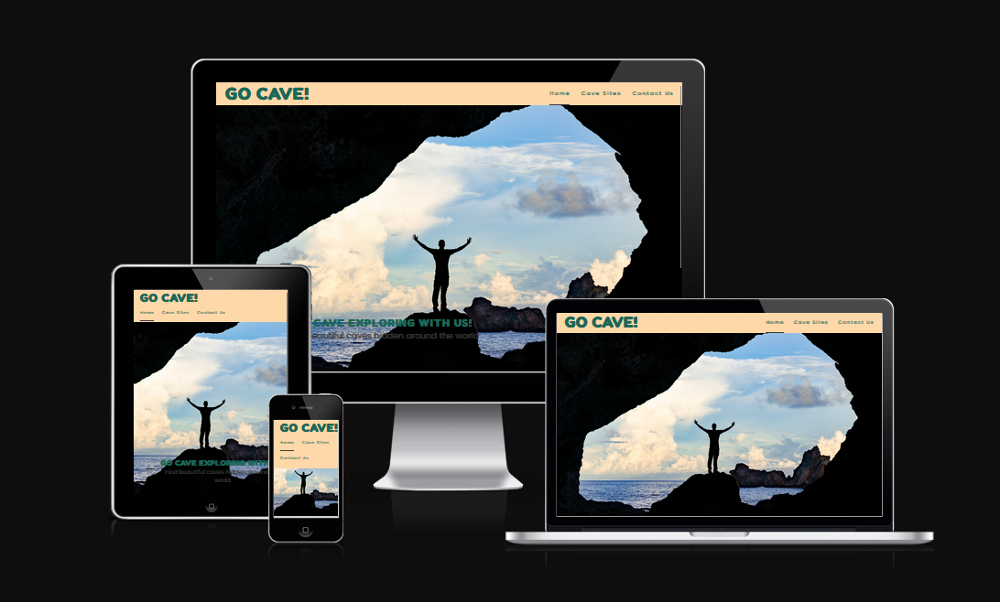
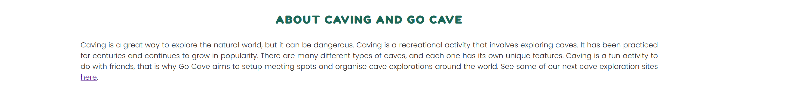
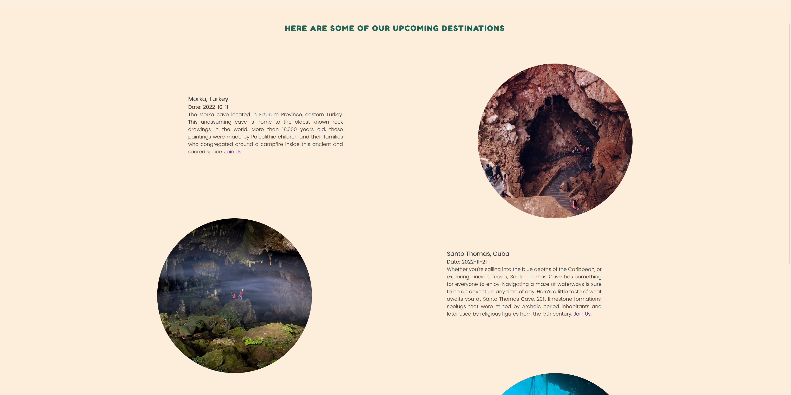
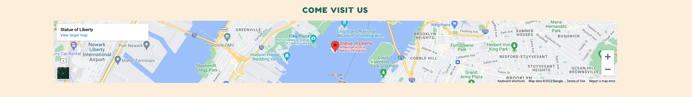

# Go Cave!

Go Cave is a site for cave exploring enthusiasts around the world who would like to experience caving with other like-minded people.
Go Cave is located in New York, USA, but the site allows anyone around the world to partake in the exploration.

## Features 

### Existing Features

- __Navigation Bar__

  - Featured on all three pages, the full responsive navigation bar includes links to the Logo, Home page, Cave Sites and Contact page and is identical in each page to allow for easy navigation.
  - This section will allow the user to easily navigate from page to page across all devices without having to revert back to the previous page via the ‘back’ button. 

- __The hero section image__

  - This section introduces the user to Go Cave with an eye catching image to grab their attention.

- __About Caving and Go Cave Section__

  - The caving and go cave section will give a brief explanation to caving and what Go Cave aims to do.

- __The Footer__ 

  - The footer section includes links to the relevant social media sites for Go Cave. The links will open to a new tab to allow easy navigation for the user. 
  - The footer is valuable to the user as it encourages them to keep connected via social media.

- __Cave Sites__

  - The cave sites page will allow the users to see upcoming cave destinations.
  - Users can also chose to join the meetups by clicking on the join us link provided in each destination description.

- __The Contact page__

  - This page will allow the user to choose which destination they are interested in and to get in contact with Go Cave for more information. The user will be asked to submit their full name and email address.
  - The users can also see where Go Cave HQ is located using the Google maps feature.

### Features Left to Implement

- Code back-end part of the contact form.
- Create a gallery page of previous explorations.
- Messaging board for previous and current cave explorers.

## Testing 

- I have clicked and made sure that all of the links in the footer works as intended. The links open in new tabs.
- The website is responsive and works on all devices and browsers.
- Clicking the "Send" button on the contact form takes information and sends it to the server.

### Validator Testing 

- HTML
  - No errors were returned when passing through the official [W3C validator](https://validator.w3.org/nu/?doc=https%3A%2F%2Fcode-institute-org.github.io%2Flove-running-2.0%2Findex.html)
- CSS
  - No errors were found when passing through the official [(Jigsaw) validator](https://jigsaw.w3.org/css-validator/validator?uri=https%3A%2F%2Fvalidator.w3.org%2Fnu%2F%3Fdoc%3Dhttps%253A%252F%252Fcode-institute-org.github.io%252Flove-running-2.0%252Findex.html&profile=css3svg&usermedium=all&warning=1&vextwarning=&lang=en#css)

[Lighthouse](assets/readme-images/lighthouse-testing-results.png)

### Unfixed Bugs

- No bugs known.

## Deployment

This section should describe the process you went through to deploy the project to a hosting platform (e.g. GitHub) 

- The site was deployed to GitHub pages. The steps to deploy are as follows: 
  - In the GitHub repository, navigate to the Settings tab 
  - From the source section drop-down menu, select the Master Branch
  - Once the master branch has been selected, the page will be automatically refreshed with a detailed ribbon display to indicate the successful deployment. 

The live link can be found here - https://davidabrahamy10.github.io/go-cave/ 

## Credits 

### Content 

- Some of the text for the Home page and Cave Sites was generated through AI using keywords. [Rytr](https://rytr.me/) 
- Instructions on how to implement form validation and style the form on the Contact page was taken from [W3Schools](https://www.w3schools.com/howto/howto_css_contact_form.asp)
- The icons in the footer were taken from [Font Awesome](https://fontawesome.com/)
- Some of the code for the Google maps location finder was taken from [embedgooglemap](https://www.embedgooglemap.net/)
- The code in the footer was taken from the Love Running example project in the CodeInstitute program [CodeInstitute](https://codeinstitute.net/se/)

### Media

- The photos used on the home, cave sites, and contact page are from https://www.pexels.com/search/cave/
Photo by M Venter: https://www.pexels.com/photo/photo-of-man-sitting-on-a-cave-1659437/
Photo by Francisco Davids: https://www.pexels.com/photo/divers-exploring-a-cave-underwater-10519070/
Photo by Quang Nguyen Vinh: https://www.pexels.com/photo/people-exploring-inside-a-cave-6870953/
Photo by Sangeet Rao: https://www.pexels.com/photo/people-inside-a-cave-7261488/
Photo by Timo Volz: https://www.pexels.com/photo/silhouette-of-a-man-standing-inside-a-cave-5443127/
